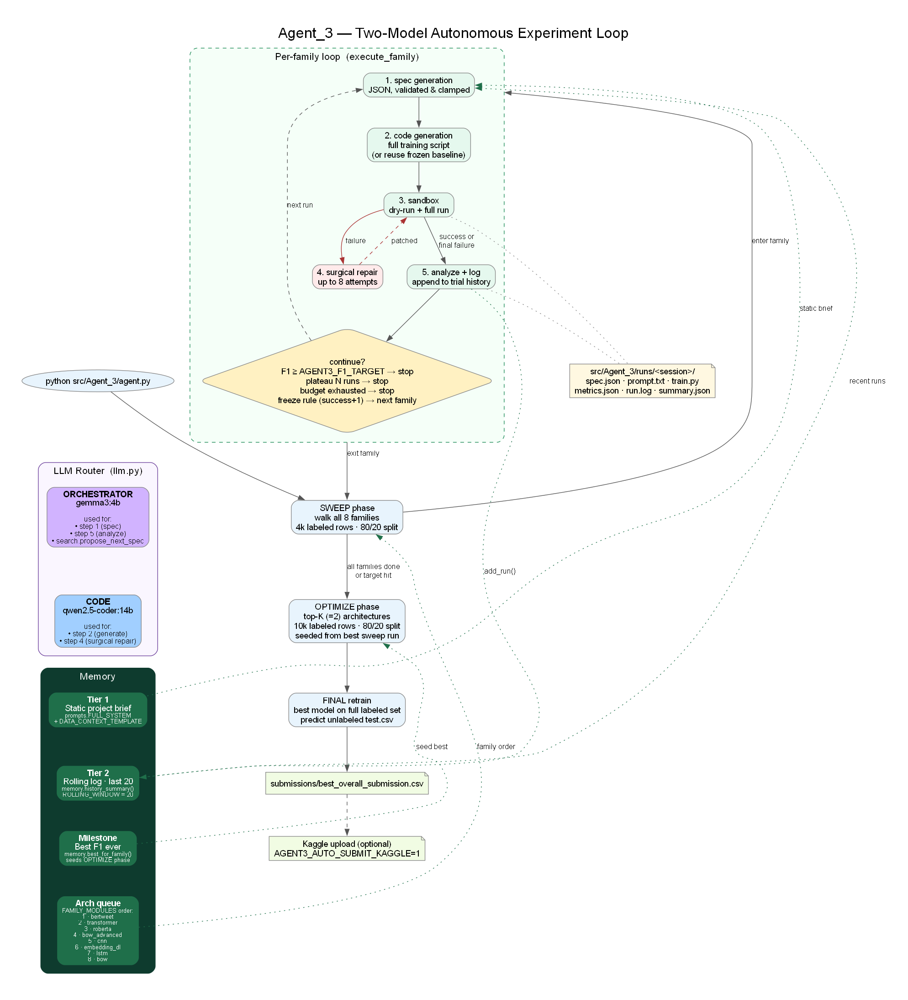

# Disaster Tweets Autonomous Research Agent

An LLM-driven experimentation agent for the Kaggle [NLP with Disaster Tweets](https://www.kaggle.com/competitions/nlp-getting-started) competition. The agent uses locally-hosted models (via Ollama) to drive a closed loop: propose spec → generate code → run sandboxed → reflect → adapt → submit.

The current agent lives in [src/Agent_3/](src/Agent_3/). The earlier [src/Agent_V2/](src/Agent_V2/) prototype is a stub — ignore it.

## Architecture



Source: [docs/architecture.dot](docs/architecture.dot) — regenerate with `dot -Tpng docs/architecture.dot -o docs/architecture.png`.

## Two-model architecture

The agent splits LLM work across two models:

| Role | Default model | Used for |
| --- | --- | --- |
| **Code** | `qwen2.5-coder:14b` | full training-script generation, surgical repair |
| **Orchestrator** | `gemma3:4b` | JSON spec planning, adaptive search proposals, run analysis |

The split is implemented in [src/Agent_3/llm.py](src/Agent_3/llm.py) via `LLMRouter`. The cheap orchestration calls (spec, search, analysis) happen on the small fast model so they don't compete with the heavier code calls for wall time. To disable the split and use one model for everything, pass the same value to `--model` and `--orchestrator-model` (or set `--orchestrator-model ""`).

## What the agent does, per family

For each architecture family it knows about:

1. asks the LLM for an experiment spec (JSON, validated and clamped to per-family ranges)
2. asks the LLM for a complete training script against a per-family scaffolding prompt in [src/Agent_3/templates/](src/Agent_3/templates/)
3. runs a dry-run (1 epoch / small slice) followed by a full run inside a sandboxed subprocess ([src/Agent_3/sandbox.py](src/Agent_3/sandbox.py))
4. on failure, requests a surgical patch from the LLM (up to 8 attempts) instead of a full rewrite ([src/Agent_3/repair.py](src/Agent_3/repair.py))
5. asks the LLM to analyse the run
6. asks the LLM for the next spec, with deterministic mutation as a fallback if the proposal is duplicate or stagnant ([src/Agent_3/search.py](src/Agent_3/search.py))
7. records every artifact (prompt, response, generated code, metrics, log) under `src/Agent_3/runs/`

After sweeping families, the agent picks the top-K architectures (default 2) and runs an **optimization phase** against a larger labeled split. The best overall model is then re-trained on the full labeled set, predictions are written for the unlabeled test set, and the submission can optionally be uploaded to Kaggle.

## Degree of autonomy — honest reading

**Automatic:**
- spec generation, code generation, error repair, reflection
- adaptive search across hyperparameters
- two-phase strategy (sweep → optimize the top-K)
- time-budgeted scheduling (skips runs that don't fit)
- final submission and Kaggle upload

**Scaffolded, not invented by the LLM:**
- the family set is fixed: `bow`, `bow_advanced`, `cnn`, `lstm`, `embedding_dl`, `transformer`, `roberta`, `bertweet`. The agent cannot invent a new family.
- each family has a Jinja template that locks pipeline shape, library, env-var contract, and metric format. The LLM fills in design **within** that contract — it does not redesign the pipeline.
- spec values are clamped to per-family ranges by [src/Agent_3/validate_spec.py](src/Agent_3/validate_spec.py).
- every family currently sets `freeze_after_first_success = True`. After the first successful run for a family, the LLM stops generating code; the runner just retunes hyperparameters in the frozen script. This is a deliberate reliability trade-off, not full architectural autonomy.
- when the LLM proposes a duplicate or stagnant spec, [search.py](src/Agent_3/search.py) falls back to a deterministic mutation of the best-known spec.

This is a deliberate design point: the scaffolding makes the loop reliable on a constrained time budget; the LLM contributes design within those rails.

## Exit criteria

A family phase ends when **any** of the following holds:

- max runs reached
- F1 target hit (`AGENT3_F1_TARGET`, default `0.88`) on a successful run
- plateau (`AGENT3_PLATEAU_PATIENCE` consecutive successful runs without `AGENT3_PLATEAU_MIN_IMPROVEMENT`)
- `freeze_after_first_success` rule: one success + one follow-up, then move on
- not enough wall-clock time left to start another run

The whole sweep stops early once any family meets the F1 target, and winner optimization is skipped if the sweep best already meets it.

## Setup

```bash
git clone <this-repo>
cd apa-disaster-tweets-agent
python3 -m venv .venv
source .venv/bin/activate            # Windows: .venv\Scripts\activate
pip install -r requirements.txt
```

Data:

```bash
mkdir -p data
kaggle competitions download -c nlp-getting-started -p data
unzip data/nlp-getting-started.zip -d data
```

Ollama must be running on `localhost:11434` with both models pulled:

```bash
ollama pull qwen2.5-coder:14b
ollama pull gemma3:4b
```

If only one model is available, pass it to both `--model` and `--orchestrator-model` (or set `--orchestrator-model ""`) — the router will fall back to a single-model setup automatically.

## Run

Whole agent (all families, sweep + optimize, default 80 minutes):

```bash
python src/Agent_3/agent.py
```

Single family:

```bash
python src/Agent_3/agent.py --family transformer --max-runs 5
```

Flags:

| Flag | Default | Meaning |
| --- | --- | --- |
| `--model` | `qwen2.5-coder:14b` | Heavy code model (generation + repair) |
| `--orchestrator-model` | `gemma3:4b` | Cheaper model (spec, search, analysis); pass empty string to disable splitting |
| `--family` | (all) | One of the 8 family keys |
| `--max-runs N` | family default | Cap on sweep runs per family |
| `--time-budget-minutes` | 80 | Total wall-clock budget |
| `--no-winner-optimization` | off | Skip the optimize-top-K phase |
| `--fresh` | off | Do not persist `agent3_log.json` |

## Environment variables

| Variable | Default | Meaning |
| --- | --- | --- |
| `AGENT3_CODE_MODEL` | `qwen2.5-coder:14b` | Default for `--model` |
| `AGENT3_ORCHESTRATOR_MODEL` | `gemma3:4b` | Default for `--orchestrator-model` |
| `DISASTER_AGENT_DATA_DIR` | `data` | Where `train.csv` / `test.csv` live |
| `DISASTER_AGENT_LLM_TIMEOUT` | `1000` | Per-LLM-call timeout (seconds) |
| `AGENT3_TOTAL_TIME_BUDGET_SECONDS` | `4800` | Total wall-clock budget |
| `AGENT3_SWEEP_BUDGET_FRACTION` | `0.65` | Fraction of budget reserved for sweep |
| `AGENT3_SWEEP_SAMPLE_ROWS` | `4000` | Labeled rows used during sweep |
| `AGENT3_FINAL_TRAIN_ROWS` | `10000` | Labeled rows used for final retrain |
| `AGENT3_F1_TARGET` | `0.88` | Stop a family phase early once a run hits this F1 |
| `AGENT3_PLATEAU_PATIENCE` | `3` | Successful runs with no improvement before stopping |
| `AGENT3_PLATEAU_MIN_IMPROVEMENT` | `0.001` | Required F1 delta to count as improvement |
| `AGENT3_TOP_ARCHITECTURES_TO_OPTIMIZE` | `2` | How many top families enter the optimize phase |
| `AGENT3_AUTO_SUBMIT_KAGGLE` | unset | Set to `1` to upload `best_overall_submission.csv` |
| `AGENT3_KAGGLE_COMPETITION` | `nlp-getting-started` | Competition slug for Kaggle upload |

## Outputs

- `src/Agent_3/runs/<session>/run_<n>/` — per-run prompt, response, generated code, metrics, log
- `src/Agent_3/runs/<session>/summary.json` — family summary (now includes `early_exit`)
- `src/Agent_3/runs/overall_best.json` — global best across families
- `submissions/best_overall_submission.csv` — final submission file

## Notes

- training data is not committed
- the agent does **not** consult external knowledge (no web/RAG). All design comes from either the family scaffolding or the local LLM.
- `src/Agent_V2/` is a stub kept for history; the runtime entry point is `src/Agent_3/agent.py`.
