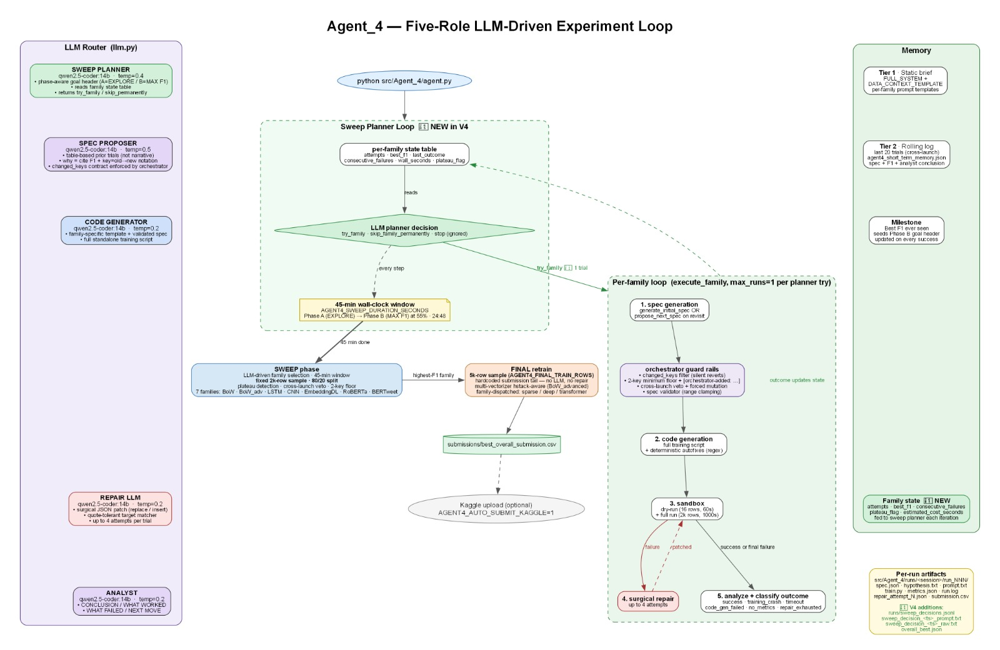

# APA Disaster Tweets — Autonomous LLM Research Agent

An autonomous LLM agent that proposes, generates, runs, repairs and evaluates ML experiments on the Kaggle [`nlp-getting-started`](https://www.kaggle.com/competitions/nlp-getting-started) binary tweet-classification task. Local LLM via Ollama, CPU-only, 1-hour budget per launch.

## To run everything

```bash
./run.sh
```

That's it. The script handles the virtualenv, installs dependencies, verifies Ollama is reachable, pulls the `qwen2.5-coder:14b` model on first launch (~9 GB, one-time), and launches the agent for the default 60-minute budget.

Useful variants:

```bash
./run.sh --time-budget-minutes 10      # quick smoke run
./run.sh --family bertweet             # one trial of a specific family
./run.sh dashboard                     # live dashboard at http://localhost:5050
```

Alternative: open `src/Agent_4/agent.py` in your IDE and click **Run**.



## Prerequisites

Before `./run.sh`, make sure Ollama is installed and running:

1. **Install Ollama**: <https://ollama.com/download> (or `brew install ollama`)
2. **Start it** in its own terminal: `ollama serve`

`./run.sh` will pull `qwen2.5-coder:14b` on first launch; if you prefer, do it manually with `ollama pull qwen2.5-coder:14b`.

## Outputs

- Per-trial artifacts: `src/Agent_4/runs/<family>_<ts>/run_NNN/`
- Kaggle CSV: `submissions/best_overall_submission.csv`
- Cross-launch memory: `logs/agent4_short_term_memory.json`

## More

- Full design rationale, experiment log, and reflections → the **project report**
- Visual playback of past runs → `./run.sh dashboard`

## Video Presentation

YouTube: <https://youtu.be/yUgWHVOmtu4>
